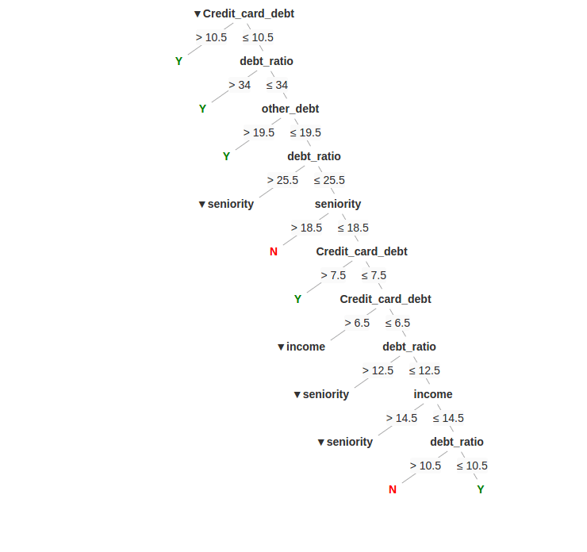

# react-dicision-tree [![Travis][build-badge]][build] [![Codecov][codecov-badge]][codecov]
react dicision tree component.




## features
- css3/js only, no images needed
- fully customizable
- umd/minified css

## use
```bash
npm i --save-dev react-dicision-tree
```

```javascript
import React, { Component } from 'react'

import DTree from 'react-dicision-tree'
// or import the jsx
// import DTree from 'react-dicision-tree/src/react-dicision-tree.jsx'

import data from './test.data.js'
import 'react-dicision-tree/dist/react-dicision-tree.min.css'
// or import the stylus
// import 'react-dicision-tree/src/style.styl'
// or just style it yourself
export default class App extends Component {

	state = {
    data: {}
  }

	render() {

		return (
			<div style={{
        minHeight: 5000,
        position: 'relative'
      }}>
				<DTree 
         data={this.state.data}
        />
			</div>
		)
	}
	
}
```
check [test.data.js](src/test.data.js) for data structure

more props, read [src](src/react-dicision-tree.jsx) for detail
```
showAllChildren: PropTypes.bool,
caretRender: PropTypes.func,
conditionRender: PropTypes.func,
renderYesLabel: PropTypes.func,
renderNoLabel: PropTypes.func,
renderTitle: PropTypes.func

```

## get/dev
```bash
git clone git@github.com:zxdong262/react-dicision-tree.git
cd react-dicision-tree

# deps install
npm i
npm i react react-dom

# start dev auto rebuild when code change)
npm start
# then edit src/*.jsx to see changes

# test and create code coverage
npm run test

```

## License
MIT

[build-badge]: https://img.shields.io/travis/zxdong262/react-dicision-tree/master.svg?style=flat-square
[build]: https://travis-ci.org/zxdong262/react-dicision-tree
[codecov-badge]: https://img.shields.io/codecov/c/github/zxdong262/react-dicision-tree/master.svg?style=flat-square
[codecov]: https://codecov.io/gh/zxdong262/react-dicision-tree